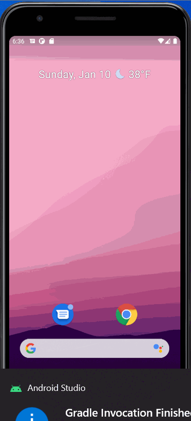
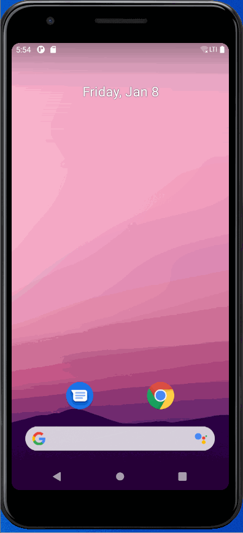
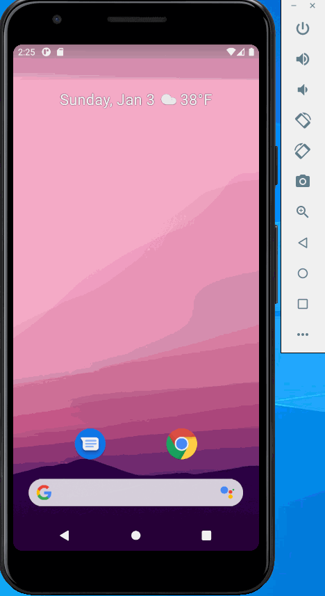
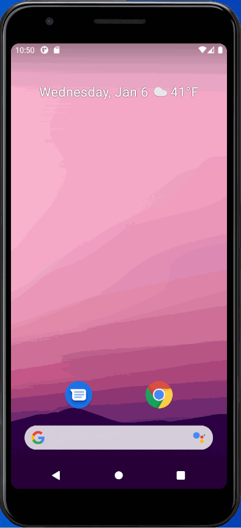

# Flashcard
## Flashcard APP

## Lab 3

### App Description
Question and Answer flashcard app

### App Walk-though

 

## Required
- [X] User can create a card and still see their created card when the app is relaunched.
- [X] User can create muliple cards and browse through all created cards

## Optional
- [X] Flashcards are shown in random order instead of the order they were created in
- [X] User can edit a card and see the edit saved when they browse through their deck of cards
- [X] User can create flashcards with multiple answers and be able to browse through cards with multiple choice answers shown

## Lab 2

### App Description
Add User input multiple line Question and Answer, Edit, save, display message, cancel or go back

### App Walk-though

 

## Required
- [X] User can click on a ‘+’ button that takes the user to new ‘Add Card Screen’
- [X] The 'Add Card Screen' has a cancel button to take the user back to the main screen
- [X] User can enter and submit a Question and Answer through the 'Add Card Screen'
- [X] User will see the card they just created on the main screen when they press the 'Save Button'
- [x] Push your progress to GitHub!

## Optional
- [X] User can edit a card
- [X] An error message is shown if the user doesn't enter both a Question and an Answer
- [X] A notification is shown if the card was created successfully
- [X] User can also enter multiple choice answers when creating a card
- [X] App is further styled and customized!

## Lab 1

### App Description
Flashcard app for question and answer

### App Walk-though
 
### App Walk-though full
 

## Required
- [X] Create New Project in Android Studio
- [X] Add a view for the front side of the flashcard to display the question
- [X] Add a view for the back side of the flashcard to display the answer
- [X] Build in logic to show the answer side when the card is tapped
- [X] Push code to GitHu
## Optional
- [X] Style the question and answer side of the card to better distinguish between the two sides
- [X] Add selectable multiple choice answers beneath the card
   - [X] Change the background color of the multiple choice answers when clicked to indicate whether the question waanswered correctly
- [X] Further customize and style the card
